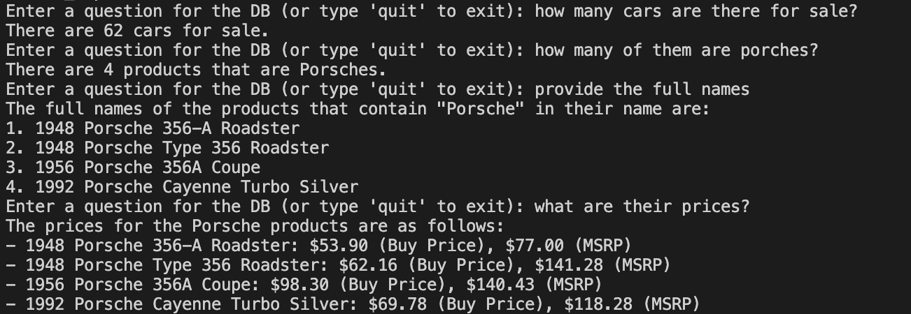

# NLToSQL

- This project aims to convert Natural Language to SQL leveraging LLMs and prompt engineering, for the same we are leveraging Chat GPT 3.5 Turbo and Langchain for the implementation. 
- We have also finetuned the performance by providing a way to select only the required tables for the prompts, using a csv which contains the description of the database. Refer to the database_table_descriptions.csv file.
- And have leveraged few shot learning method provided for openAI models via langchain to train the model to the pecific kind of queries that we need answered. Refer to the few_shot_samples.json file.

This script can be run on any local msql database provided you input the correct username, password, host name and DB name. All of these can be passed as arguments to the command to run the provided script.

To run this code please traverse into the directory where the NLT0SQL.py script is present and use run the below command with your Open AI API key on your own database please use the below command:

```
python3 NLToSQL.py --db_user "SQL_DB_Username" --db_password "PASSWORD" --db_host "HOSTNAME" --db_name "DATABSE_NAME" --open_ai_key "YOUR_OPEN_AI_API_KEY"
```

You can make required changes to the the database_table_descriptions.csv and few_shot_samples.json files as per your requirement. If need be you can use your own files for the same too, please refer to the below example command:

```
python3 NLToSQL.py --desc_path "PATH_FOR_DATABASE_DESCRIPTION" --example_path "few_shot_examples_path" --db_user "SQL_DB_Username" --db_password "PASSWORD" --db_host "HOSTNAME" --db_name "DATABSE_NAME" --open_ai_key "YOUR_OPEN_AI_API_KEY"
```

Setting up the dummy DB for testing(Implement this before running the above command):

```
sudo apt-get -y install mysql-server

sudo service mysql start

sudo mysql -e "ALTER USER 'root'@'localhost' IDENTIFIED WITH 'mysql_native_password' BY 'root';FLUSH PRIVILEGES;"

mysql -u root -p (then input the password i.e. root)

mysql> source ~/database/mysqlsampledatabase.sql
```

Example implementation on dummy database post running the code:




